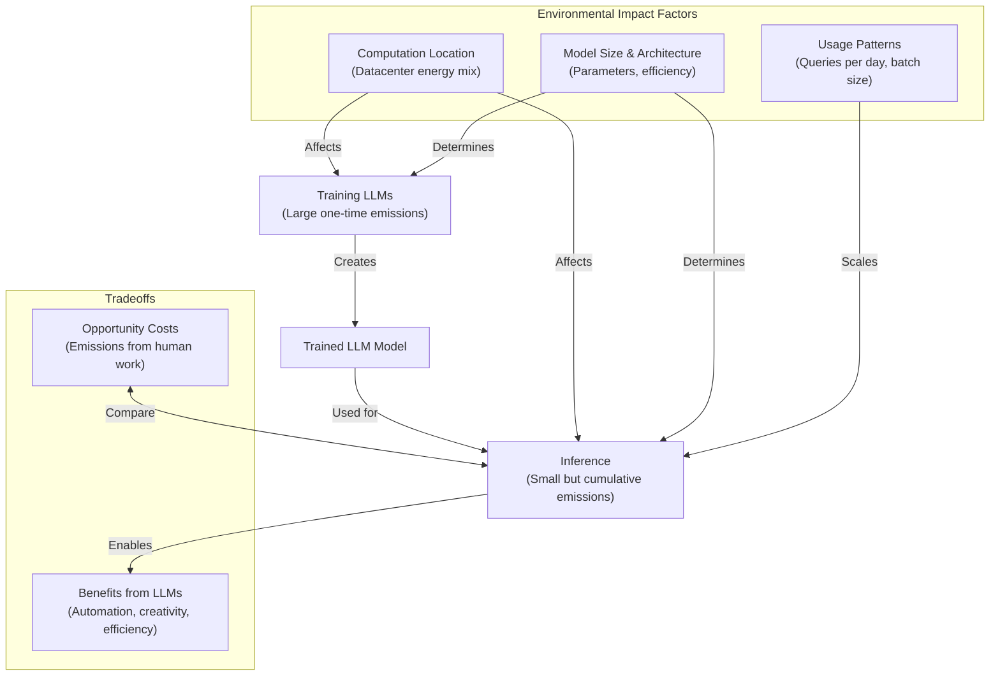

# 🤖 Environmental Concerns

import Mermaid from "@theme/Mermaid";

## Environmental Impact of AI Systems

As AI systems become increasingly integrated into our daily lives and research workflows, it's important to understand their environmental footprint. The carbon and resource costs of developing and deploying AI models present significant sustainability challenges that researchers should consider.


### Understanding the Environmental Lifecycle of LLMs

The environmental impact of large language models can be visualized through their complete lifecycle:



### Carbon Footprint Components

The environmental impact of AI systems comes from multiple sources throughout their lifecycle. Training represents a large upfront carbon cost, while fine-tuning has a lower but still significant impact per update. Inference costs accumulate with each query, potentially exceeding training costs at scale. Additionally, hardware manufacturing, supply chains, and infrastructure requirements (data centers, cooling systems, networking) all contribute to the overall footprint.

### Comparing Energy Scales

To put AI energy consumption in perspective, Bitcoin mining consumes approximately 100-121 TWh per year, comparable to the entire energy usage of the Netherlands. The AI sector as a whole is estimated to use about 169 TWh annually as of 2024, with LLM training specifically accounting for roughly 1-2 TWh per year.

At a more individual scale, pre-training a large language model consumes energy equivalent to a transatlantic flight. Each prompt to an LLM uses energy comparable to a 100W light bulb burning for 60 hours, while generating an AI image requires energy similar to charging a mobile phone.

:::warning
At scale, the cumulative energy used for inference can eventually exceed the one-time training cost.
:::

### The Scale of Impact

When we consider that training an LLM requires energy equivalent to a transatlantic flight, the scale becomes clearer when we realize there are approximately 1,000 flights between Europe and the US every day. Similarly, the energy required for text generation adds up quickly - generating 250 words uses energy comparable to a Google search (about 0.00037 kWh), while generating 12.5 million words would use energy equivalent to a light bulb burning for a month. For context, it would take a human 24 years to write that much text.

### Hardware and Water Footprint

Beyond energy consumption, AI systems have other environmental impacts. GPUs and TPUs require rare earth metals with their own extraction and manufacturing footprints. Data centers add overhead, though they may be more efficient than distributed computing in some cases.

Water usage is a less discussed but significant concern. AI data centers pump millions of gallons of water daily for cooling systems. Global AI water consumption exceeds Denmark's annual water demand. The regional impact varies significantly - in the US, about 30 prompts to an AI system use water equivalent to a bottle of water, while in Ireland it takes around 70 prompts to reach the same water usage.

### Carbon Calculation Factors

When assessing the environmental impact of machine learning models, several key factors come into play:

- Model size (memory requirements)
- Training compute (measured in petaflop-days)
- Datacenter location (affects energy sources)
- Power Usage Effectiveness (PUE)
- Carbon intensity of electricity

The [ML CO₂ Impact Calculator](https://mlco2.github.io/impact/) can help estimate these impacts, though it's important to note that infrastructure efficiency isn't guaranteed, as setting hyperparameters optimally remains challenging.

### Improving Efficiency

Efficiency improvements can happen at multiple levels:

**Datacenter Efficiency:**
Large datacenters often implement advanced cooling systems, solar roofs, and other sustainability measures that improve overall efficiency. They also utilize specialized hardware like TPUs and GPUs that are designed for AI workloads.

**Model Efficiency:**
Distilled models (smaller models trained to mimic larger ones) and lower precision models (using fewer bits to represent numbers) can dramatically reduce resource requirements while maintaining acceptable performance.

### The Efficiency Chain

Efficiency improvements cascade through the entire system:


### Net Emissions Scenarios

Determining the net emissions impact of generative models is complex and depends on both their implementation and how they're used. Consider these contrasting scenarios:

1. A sophisticated LLM with advanced reasoning capabilities (generating more tokens during inference) is adopted by a small group of people, with some usage focused on sustainability innovation.

2. A simpler LLM generating fewer tokens per inference is adopted by many more people with no specific sustainability focus.

The environmental impact over time can vary dramatically between these scenarios, especially if the first model enables innovations that reduce emissions in other areas.

### Measuring Your Code's Carbon Footprint

You can track the carbon emissions of your own code using tools like CodeCarbon:

```python
from codecarbon import EmissionsTracker

emission_tracker = EmissionsTracker()
emission_tracker.start()

# your code here (also API calls to LLMs)

emission_log = emission_tracker.stop()

print(emission_log)
```

### Best Practices for Sustainable AI

**Recommended Practices:**
- Be mindful of computational resources and stay informed about efficiency improvements
- Use state-of-the-art LLMs (not necessarily the largest ones)
- Prefer newer, more efficient GPU/TPU hardware
- Utilize lower-precision models (e.g., 8-bit integer instead of 32-bit floating point)
- Implement efficient fine-tuning methods like LoRA instead of full-parameter fine-tuning
- Research which data centers have greener energy profiles and prioritize them for your computing needs

**Practices to Avoid:**
- Writing code from scratch before considering AI assistance tools
- Defaulting to the largest LLM for every task regardless of requirements
- Using the most expensive model when a simpler one would suffice
- Employing reasoning-focused models for tasks that don't require complex reasoning
- Using large-scale image or video generation without clear purpose

:::tip
Consider attending follow-up workshops to learn how to use generative AI for coding more efficiently and how to leverage Git and GitHub for your research projects.
:::