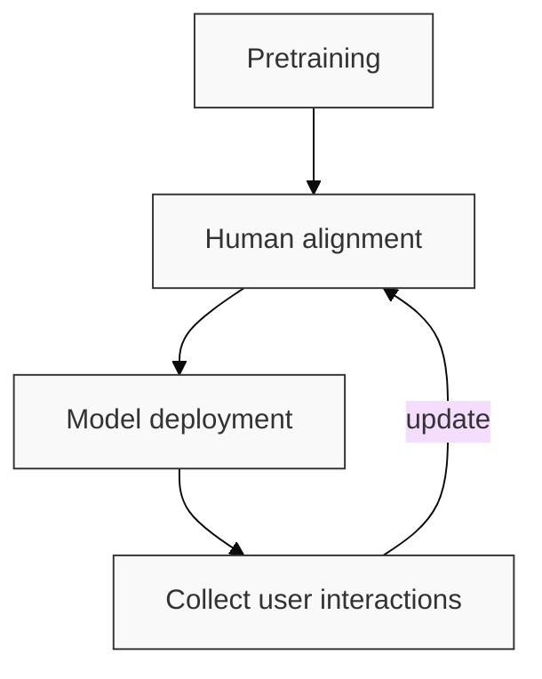
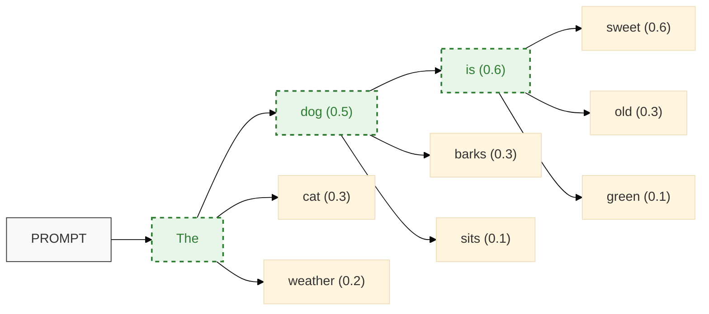
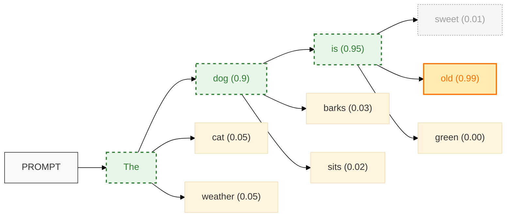
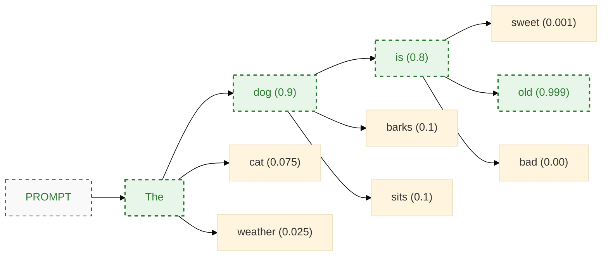
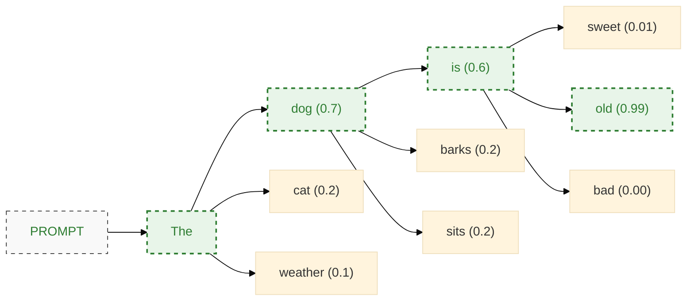
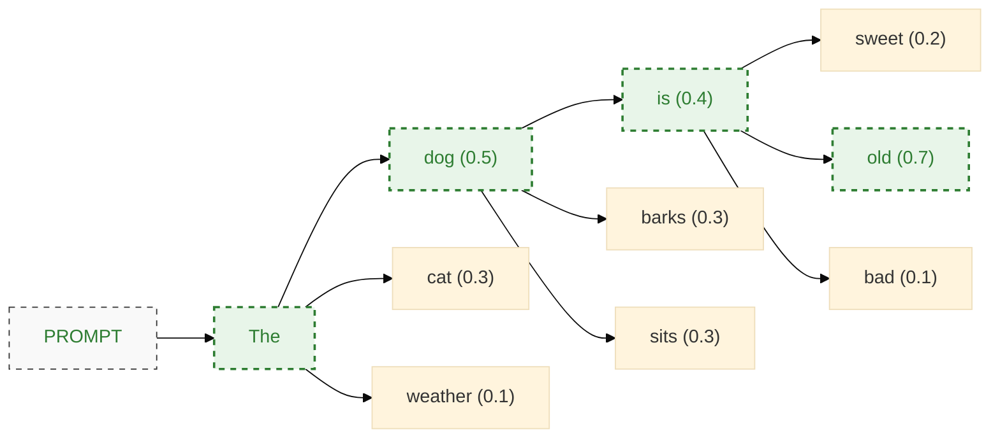

# 🤖 LLM Core Concepts

import Mermaid from "@theme/Mermaid";

## How are LLMs Created?

Large Language Models (LLMs) follow a multi-stage development process that combines massive datasets with human feedback. Understanding this process helps researchers better evaluate the capabilities and limitations of these models.



The training data for modern LLMs comes from diverse sources. According to Gao et al. (2021), these typically include Wikipedia (2%), Common Crawl (18%), and academic papers (33%). After initial pretraining, models undergo alignment processes to better match human expectations and values, as described in research by Ouyang et al. (2022) and Rafailov et al. (2023).

:::info Different flavors of LLMs
LLMs come in several specialized variants:
- Instruction tuned models (like chat-based systems)
- Multi-modal models that handle different types of data (e.g., GPT-4o)
- Reasoning-focused models (e.g., GPT-o1, DeepSeek R1)
- Agentic models designed to take actions (e.g., Manus)
:::

## Training Data

The composition of training data significantly impacts what an LLM can learn. The Pile dataset, described by Gao et al. (2021), represents one of the most comprehensive collections used for training modern language models.


## How LLMs Generate Text

Understanding how LLMs generate text is fundamental to working with them effectively. Let's explore the core mechanics of text generation.

### Auto-Regressive Prediction

At its core, an LLM auto-regressively predicts the next token in a sequence of tokens. This means the model:

- Works step by step, generating one token at a time
- Makes probabilistic predictions based on previous tokens
- Operates in one direction (forward only)
- Processes tokens (which may be characters, sub-words, or special tokens)
- Uses the sequence of previous tokens as conditioning information

### The Generation Process

When an LLM receives a prompt, it begins a probabilistic process of text generation:



Each prediction can be represented as a conditional probability. For example:

$$
0.6 = P(\text{sweet} \mid \text{is}, \text{dog}, \text{The})
$$

The model continues this process until it generates an end-of-sequence token or reaches a predefined length limit:

$$
0.95 = P(\text{<eos>} \mid \text{sweet}, \text{is}, \text{dog}, \text{The})
$$

### The Impact of Prompts

A well-crafted prompt significantly influences the model's output by steering the probability distribution of tokens. For example, when prompted with "Describe the very old german shepherd to me," the model's probability distribution shifts dramatically:



## Temperature: Controlling Randomness

Temperature is a crucial hyperparameter that controls the randomness in text generation. It affects how the model samples from the probability distribution of next tokens.

### Low Temperature (0.0)

At a temperature of 0, the model becomes deterministic, always selecting the most probable token:



This creates a probability distribution that heavily favors the most likely token (0.999 for "old"), effectively eliminating randomness.

### Medium Temperature (0.5)

At a moderate temperature of 0.5, the model maintains some preference for likely tokens while allowing for some variation:



### High Temperature (1.0)

At a temperature of 1.0, the model samples more freely from the distribution, leading to more diverse and potentially creative outputs:



### Choosing the Right Temperature

The optimal temperature setting depends on your specific use case:
- Use lower temperatures (0.0-0.3) for factual, deterministic tasks like coding or fact retrieval
- Use medium temperatures (0.4-0.7) for balanced responses that maintain coherence while allowing some creativity
- Use higher temperatures (0.8-1.0) for creative tasks like brainstorming or storytelling

## Tool Use in LLMs

Modern LLMs can be enhanced with the ability to use external tools during the generation process. This capability dramatically expands what these models can accomplish.

```mermaid
%%{init: { 'logLevel': 'debug', 'theme': 'base' }}%%
graph LR
    start["PROMPT"]:::highlight4 --> A["The current"]
    A --> B1["time (0.6)"]:::tool
    A --> B2["weather (0.3)"]
    A --> B3["date (0.1)"]
    
    B1 -->|"Call time_tool()"| C1["is (0.9)"]:::highlight1
    B1 --> C2["was (0.05)"]
    B1 --> C3["will be (0.05)"]
    
    C1 --> D1["3:45 PM (1.0)"]:::highlight2
    
    style start fill:#f9f9f9,stroke:#333,stroke-width:1px
    
    classDef probabilityNode fill:#e1f5fe,stroke:#01579b,stroke-width:1px
    classDef tool fill:#fff3e0,stroke:#e65100,stroke-width:2px,color:#e65100
    classDef highlight1 fill:#e8f5e9,stroke:#2e7d32,stroke-width:2px,color:#2e