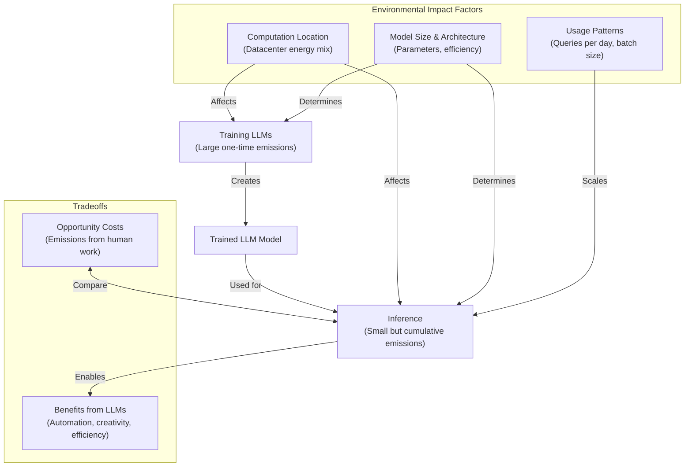

# Environmental Concerns 🌱

import Mermaid from "@theme/Mermaid";

As we delve into the environmental impact of Large Language Models (LLMs), it's crucial to understand the complex interplay between their benefits and potential ecological concerns. This section will explore the various factors contributing to LLMs' carbon footprint, from training to inference, and discuss strategies for mitigating their environmental impact.

## The Lifecycle of LLM Emissions

The environmental impact of LLMs can be broadly categorized into two main phases: training and inference. Each phase has distinct characteristics and implications for energy consumption and carbon emissions.

To better understand the environmental impact factors and tradeoffs associated with LLMs, let's examine the following flowchart:

This flowchart illustrates the complex relationships between training, inference, and various environmental impact factors. It also highlights the potential benefits and opportunity costs associated with LLM usage.

## Training Phase: The Initial Carbon Investment

The training phase of LLMs requires massive computational resources and storage, resulting in significant energy consumption and carbon emissions. For instance, training GPT-3 consumed approximately 1,287 MWh of energy, leading to an estimated 552 tonnes of CO₂ equivalent emissions. Similarly, training the Llama-3 (70B) model used about 0.5×10^6 kWh, comparable to the energy consumption of a transatlantic flight.

To put this into perspective, the energy used for training a large LLM is equivalent to the annual energy usage of about 120 US homes. It's important to note that these figures don't include the additional energy required for dataset curation and preprocessing, which can add substantial overhead to the overall environmental impact.

## Carbon Footprint Components

When assessing the environmental impact of LLMs, we need to consider several key components:

1. Training: This represents a large upfront cost in terms of energy and emissions.
2. Fine-tuning: While lower in cost than initial training, updates and fine-tuning still contribute to the overall footprint.
3. Inference: The per-query cost, which accumulates over time with usage.
4. Hardware manufacturing and supply chain: The embodied carbon in the production of GPUs, TPUs, and other necessary hardware.
5. Infrastructure: The energy consumption of data centers, cooling systems, and networking equipment.

## Training vs. Inference: A Balancing Act

While the training phase has a high upfront environmental cost, the inference phase's impact accumulates over time with usage. Let's compare the two:

### Training (One-time)
Training large models like GPT-3 consumes about 1.29×10^6 kWh in total, while Llama-3 (70B) uses approximately 0.5×10^6 kWh. These figures are comparable to the energy consumption of a transatlantic flight, representing a significant initial environmental investment.

### Inference (Per-use)
In contrast, inference has a much lower per-use energy cost. For example, generating a 500-word page using Llama-3 consumes only about 0.020 kWh, equivalent to running a 100W light bulb for a few minutes. However, when scaled to billions of queries, the cumulative energy consumption can become substantial.

:::info
At scale, the cumulative energy consumption from inference can eventually exceed the one-time training cost, highlighting the importance of optimizing both phases for environmental sustainability.
:::

## Putting LLM Energy Consumption into Perspective

To better understand the scale of LLM energy consumption, let's consider some comparisons:

1. Training an LLM consumes energy on par with a single overseas flight. However, there are approximately 1,000 flights between Europe and the US every day.

2. Generating 250 words with an LLM requires about as much energy as a Google search (approximately 0.00037 kWh).

3. Generating 12.5 million words requires the same energy as a light bulb burning for 60 hours. For context, it would take a human about 24 years to write that much content.

These comparisons help illustrate that while LLM energy consumption is significant, it's important to consider the scale of usage and the potential productivity gains when assessing their overall impact.

## Lifecycle Emissions and Hardware Footprint

Beyond the direct energy consumption of training and inference, we must also consider the broader lifecycle emissions and hardware footprint of LLMs:

- The manufacturing of GPUs and TPUs contributes significantly to embodied carbon, accounting for approximately 10-30% of lifecycle emissions.
- Data center Power Usage Effectiveness (PUE) adds an additional 10-20% overhead to energy consumption.
- Electronic waste and end-of-life disposal of hardware pose additional environmental concerns.
- Water usage in AI data centers is substantial, with "millions of gallons" pumped daily for cooling purposes.
- The supply chain for AI hardware involves mining, transport, and the use of rare earth metals, all of which have downstream environmental effects.

## The Hidden Water Footprint

Water consumption is an often-overlooked aspect of LLM environmental impact. Consider these facts:

- Training GPT-3 can evaporate up to 700,000 liters of clean freshwater.
- Global AI demand is projected to withdraw 4.2-6.6 billion cubic meters of water by 2027, equivalent to 4-6 times Denmark's annual water withdrawal.

The water usage per interaction varies by region due to different cooling technologies and climate conditions:

- In the US, each ChatGPT prompt uses about 16.9 mL of water (30 prompts empty a water bottle).
- In Ireland, it's around 7 mL per prompt (70 prompts empty a water bottle).
- Sweden has high water usage but abundant resources, presenting a water-carbon tradeoff.

## Carbon Calculator: Estimating LLM Emissions

To help researchers and developers estimate the carbon footprint of their ML models, tools like the ML CO₂ Impact Calculator have been developed. This calculator takes into account several key factors:

- Model size (number of parameters)
- Training compute (in petaflop-days)
- Datacenter location
- Training duration
- Power Usage Effectiveness (PUE)
- Carbon intensity of electricity

You can access the [ML CO₂ Impact Calculator here](https://mlco2.github.io/impact/).

:::caution
It's important to note that these calculations assume efficient use of infrastructure. In practice, setting hyperparameters and optimizing model training is not trivial, which can lead to less efficient resource utilization.
:::

## Economies of Scale in LLM Deployment

When considering the environmental impact of LLMs, it's crucial to understand the economies of scale at play:

### Shared Resources
LLMs benefit from shared infrastructure, where one trained model can serve millions of users. This leads to several efficiency gains:

- The per-query carbon cost becomes minimal when spread across many users.
- High-efficiency datacenters (with PUE < 1.1) further reduce overall energy consumption.
- Specialized hardware like TPUs and GPUs optimize processing efficiency.
- Continuous improvements in inference optimization reduce energy use over time.

### Emissions Per Query
While the aggregate impact of LLM usage is significant, the per-query emissions are relatively low:

- An average ChatGPT query uses about 10 times the energy of a Google search.
- Generating an AI image consumes roughly the same energy as charging a smartphone.
- Producing 500 words on Llama-3 uses approximately 0.020 kWh, equivalent to running a 100W bulb for 12 minutes.
- In comparison, a human writing the same content would use about 0.85 kWh, making the LLM 40-150 times more energy-efficient for this task.

## Model Size and Efficiency: A Crucial Balance

The size and architecture of LLMs significantly impact their energy consumption and environmental footprint:

### Size Differences
Smaller models can be dramatically more efficient:

- Llama-3 (70B parameters) uses 0.020 kWh per 500-word page.
- Gemma-2B (2B parameters) uses only 0.00024 kWh for the same task.
- This represents a 100x or greater efficiency improvement for smaller models.

However, it's important to note that there are capability trade-offs when using smaller models.

### Architectural Efficiency
Researchers are exploring various methods to improve LLM efficiency:

- Sparse activation methods reduce the number of parameters used in each forward pass.
- Parameter-efficient fine-tuning techniques allow for task-specific adaptations with minimal additional training.
- Knowledge distillation can compress larger models into more efficient smaller ones.
- Meta-learning approaches aim to create more adaptable models that require less task-specific fine-tuning.

The focus is shifting towards "efficiency over sheer size" in LLM development.

## LLMs vs. Cryptocurrencies: An Emissions Comparison

To put LLM emissions into a broader context, it's helpful to compare them with other digital technologies, particularly cryptocurrencies:

- Bitcoin's annual energy consumption is estimated at 100-121 TWh, comparable to the entire energy usage of the Netherlands.
- AI data centers used approximately 20-125 TWh in 2023, with projections reaching 169 TWh in 2024.
- All LLM training combined accounts for about 1-2 TWh annually.

This comparison highlights that while LLM energy consumption is significant, it's still considerably less than some other digital technologies.

## AI Emissions in the Broader Context

To fully appreciate the environmental impact of LLMs and AI, we need to consider them within the larger landscape of global energy consumption:

- Data centers already consume about 2% of global electricity. In data-center-heavy regions like Ireland, this figure can reach up to 20% of electricity consumption.
- The total annual energy consumption for LLM inference is estimated at around 100 GWh, which is relatively small compared to the energy used for training.
- For perspective, global data traffic consumes approximately 1000 TWh per year.
- On a per-user basis, LLM usage typically results in 1-10 kg CO₂eq emissions annually, varying based on usage patterns.

Despite these figures, there's potential for AI to contribute to sustainability efforts. AI applications in energy optimization, climate modeling, and resource management could potentially yield net emissions savings in the long run.

## LLMs vs. Human Effort: An Energy Efficiency Comparison

When assessing the environmental impact of LLMs, it's insightful to compare their energy efficiency to that of human effort:

### Human Energy Use
- The human body uses about 0.12 kWh per hour for cognitive tasks like writing.
- An average US worker's lifestyle energy consumption is around 6 kWh per work-hour.
- Writing a 500-word page typically consumes about 0.85 kWh for a human.
- These figures vary significantly based on country and lifestyle factors.

### LLM Efficiency
- Llama-3 generates 500 words using approximately 0.020 kWh.
- This makes LLMs 40-150 times more energy-efficient than a US human for this task.
- Compared to workers in countries with lower energy consumption, LLMs are still 3-16 times more efficient.
- On a per-word basis, LLMs can be hundreds of times more energy-efficient than human writing.

:::caution
It's important to note that these efficiency gains only apply to necessary work. Generating unnecessary content with AI negates any potential environmental benefits.
:::

## Net Emissions Scenarios: A Complex Picture

Determining the net emissions impact of LLMs is challenging due to the variety of use cases and potential indirect effects. Let's consider two hypothetical scenarios to illustrate this complexity:

1. Scenario 1: A "reasoning" LLM with higher per-query emissions is adopted by a small group, some of whom use it for sustainability innovation.
2. Scenario 2: A more efficient LLM is widely adopted but without specific focus on sustainability applications.

The following graphs illustrate how these scenarios might play out over time:

These scenarios demonstrate that the net environmental impact of LLMs depends on factors beyond just their direct energy consumption, including their application and potential for driving innovation in sustainability.

## Practical Exercise: Estimating LLM Carbon Footprint

To better understand the real-world implications of LLM energy consumption, let's use the ML CO₂ Impact Calculator to estimate the carbon footprint of a typical model:

1. Go to the [ML CO₂ Impact Calculator](https://mlco2.github.io/impact/).
2. Estimate the carbon footprint of training a 7B parameter model for 7 days.
3. Explore how the footprint changes with different datacenter locations.
4. Compare the results to your daily activities (e.g., driving, food consumption).

Take about 10 minutes to explore the calculator and discuss your findings with your group. One group will be selected to present their results to the class.

## Strategies for Reducing Your LLM Carbon Footprint

As researchers and practitioners working with LLMs, there are several strategies we can employ to minimize our environmental impact:

### Model Selection
- Choose the smallest model that sufficiently meets your needs. Consider 8-13B parameter models instead of 70B+ when possible.
- Use task-specific fine-tuned models rather than general-purpose ones for specialized tasks.
- Implement batch processing for improved efficiency.
- Optimize prompts and limit output length to reduce unnecessary computation.

### Infrastructure Choices
- Select datacenters powered by renewable energy sources.
- Prefer regions with lower carbon intensity for your computations.
- Utilize high-efficiency GPU/TPU hardware.
- Choose facilities with low Power Usage Effectiveness (PUE), ideally around 1.1.
- Implement caching for frequently repeated queries to avoid redundant computation.

### Development Practices
- Leverage pre-trained models instead of training from scratch when possible.
- Use efficient fine-tuning techniques like LoRA (Low-Rank Adaptation).
- Employ knowledge distillation to create smaller, more efficient models.
- Implement model quantization to reduce computational requirements.
- Focus on high-value tasks that justify the computational resources used.

## Carbon Offsetting: A Complementary Approach

While direct reduction of emissions should be the primary goal, carbon offsetting can be a complementary strategy for addressing the unavoidable environmental impact of LLM usage:

### Offset Strategies
- Purchase renewable energy certificates to support clean energy production.
- Invest in verified carbon offset projects, such as reforestation or renewable energy initiatives.
- Support direct air capture technologies that remove CO2 from the atmosphere.
- Participate in carbon removal marketplaces that fund various offsetting projects.

### Tracking Tools
- Utilize cloud provider carbon dashboards to monitor your resource usage and associated emissions.
- Implement hardware energy monitoring systems in your own infrastructure.
- Use ML operation tracking platforms that include carbon footprint estimation features.

:::caution
Remember that carbon offsets should complement, not replace, direct efforts to reduce emissions