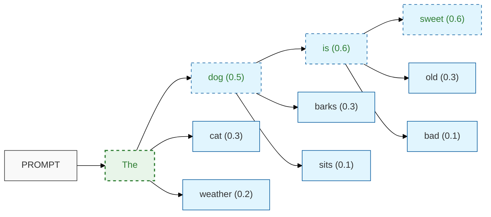
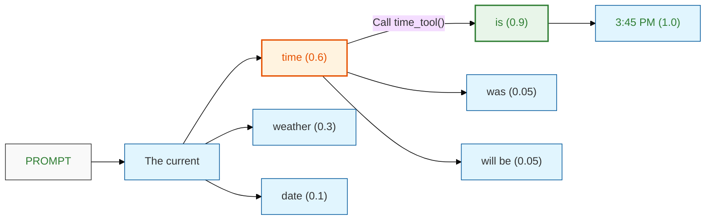

# LLM Core Concepts 💡

import Mermaid from "@theme/Mermaid";

In this section, we'll explore the core concepts behind Large Language Models (LLMs) and how they function. Understanding these fundamentals is crucial for effectively utilizing LLMs in research and applications.

## The Creation of LLMs

Large Language Models are developed through a multi-stage process that involves massive amounts of data and complex training procedures. The process typically follows these key steps:

1. Pretraining: The model is initially trained on a vast corpus of text data, including sources like Wikipedia, academic papers, and web content.

2. Human alignment: The model is fine-tuned to better align with human expectations and values.

3. Model deployment: The refined model is made available for use.

4. User interaction collection: Feedback and interactions from users are gathered to further improve the model.

5. Iterative improvement: The collected data is used to update and refine the model in subsequent versions.


The training data for LLMs is diverse and extensive. For example, one prominent dataset used in LLM training, known as "the Pile," consists of Wikipedia (2%), Common Crawl web data (18%), and academic papers (33%), among other sources.

## Different Flavors of LLMs

:::info
LLMs come in various specialized forms, each designed for specific tasks or capabilities:

- Instruction-tuned models (e.g., chat-based models)
- Multi-modal models (e.g., GPT-4V, capable of processing both text and images)
- Reasoning-focused models (e.g., GPT-3.5, DeepSeek R1)
- Agentic models (e.g., Manus, designed to act more autonomously)
:::

## Generating Text with LLMs

Understanding how LLMs generate text is crucial for effectively using them. Let's break down the process:

1. Auto-regressive Prediction: An LLM predicts the next token in a sequence based on the previous tokens. This process is repeated step-by-step to generate coherent text.

2. Probabilistic Nature: The prediction is probabilistic, meaning the model assigns probabilities to potential next tokens rather than deterministically choosing one.

3. Unidirectional Processing: LLMs typically process text in one direction, from left to right in most languages.

4. Token-based Approach: The model works with tokens, which can be words, parts of words, or even individual characters, depending on the model's design.

5. Conditioning on Context: The sequence of tokens already generated serves as the conditioning set of information for predicting the next token.

Here's a visualization of how an LLM might generate text based on a prompt:



In this example, the model predicts probabilities for each potential next token based on the previous tokens. The highlighted path shows one possible sequence of token selections.

## The Impact of Temperature

Temperature is a crucial hyperparameter in LLM text generation. It affects how the model selects tokens during the generation process:

- Low temperature (close to 0): The model becomes more deterministic, consistently choosing the most probable tokens. This can lead to more focused and predictable outputs.

- High temperature (close to or above 1): The model becomes more random in its token selection, potentially leading to more diverse and creative outputs, but also increasing the risk of incoherence.

Here's how changing the temperature affects the probability distribution of token selection:

```r
#| echo: false
#| warning: false
#| fig.width: 10
#| fig.height: 6

library(ggplot2)
library(tidyr)
library(dplyr)

# Create data frame
dfData <- data.frame(
  sWord = c("sweet", "old", "bad"),
  dProb = c(0.15, 0.8, 0.05)
)

# Create plot
ggplot(dfData, aes(x = sWord, y = dProb)) +
  geom_bar(stat = "identity", fill = "#01579b") +
  geom_text(aes(label = dProb), vjust = -0.5) +
  scale_y_continuous(limits = c(0, 1)) +
  theme_minimal() +
  labs(x = "", y = "") +
  theme(
    panel.grid.major = element_blank(),
    panel.grid.minor = element_blank(),
    axis.text = element_text(size = 12)
  )
```

Understanding and adjusting the temperature allows you to control the balance between creativity and consistency in the model's outputs.

## Tool Use in Decoding

Advanced LLMs can integrate external tools into their text generation process. This capability enhances their ability to provide accurate and up-to-date information. Here's an example of how an LLM might use a time tool to answer a question:



In this scenario, the LLM recognizes the need for current time information and calls an external time tool to provide an accurate response.

## Writing Effective Prompts

Crafting good prompts is essential for getting the best results from LLMs. Here are some key principles for writing effective prompts:

1. Be specific: Clearly state what you want the model to do.
2. Provide context: Give the model relevant background information.
3. Use examples: Demonstrate the desired output format or style.
4. Allow for uncertainty: Encourage the model to express doubt when appropriate.
5. Iterate and refine: Adjust your prompt based on the model's responses.

:::tip
A strong baseline approach is to describe your situation to a powerful LLM and ask it to write a prompt for you. This meta-prompting technique can often yield well-structured and effective prompts.
:::

By understanding these core concepts of LLMs, you'll be better equipped to leverage their capabilities in your research and applications. Remember that LLM technology is rapidly evolving, so staying updated with the latest developments is crucial for maximizing their potential.